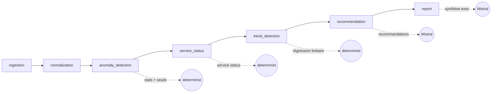

# Infra Optimizer — Test Technique Devoteam

> Pipeline modulaire d'optimisation d'infrastructure technique pour Jean (CTO de PME française).
> Ingère des métriques d'infrastructure → détecte des anomalies → génère un rapport structuré avec des recommandations actionnables propulsées par Mistral.

[]()
[]()
[]()
[]()

---

## Sommaire

- [Contexte](#contexte)
- [Démonstration](#démonstration)
- [Architecture](#architecture)
- [Choix techniques](#choix-techniques)
- [Installation](#installation)
- [Utilisation](#utilisation)
- [Sortie](#sortie)
- [Structure du projet](#structure-du-projet)
- [Tests](#tests)
- [Évolutions possibles](#évolutions-possibles)

---

## Contexte

Test technique Devoteam : développer une application modulaire qui résout une problématique concrète pour une PME française.

**Persona :** Jean, CTO d'une PME française.
**Besoin :** Comprendre l'état de santé de son infrastructure et recevoir des recommandations actionnables sans avoir à analyser manuellement des milliers de points de données.

**Le pipeline répond à 4 questions :**
1. Que s'est-il passé sur mon infrastructure ces 10 derniers jours ?
2. Qu'est-ce qui ne va pas et à quel point ?
3. Est-ce que ça se dégrade progressivement ? (détection de tendances)
4. Est-ce qu'on va mieux ou moins bien que la semaine dernière ? (mode comparaison)
5. Que dois-je faire en premier ? (recommandations LLM)

**Deux interfaces :**
- **CLI** — pour exécution rapide, CI/CD, scripts
- **Dashboard Streamlit** — pour Jean (upload, analyse en 1 clic, visualisation)

---

## Démonstration

Sur le dataset fourni (500 snapshots, 30min d'intervalle, du 2023-10-01 au 2023-10-11) :

```
$ optimizer analyze data/infrastructure_metrics.json

╭───────────────────────────── Synthèse exécutive ─────────────────────────────╮
│ La saturation critique des ressources (CPU à 98%, disque à 89%, taux         │
│ d'erreurs à 12%) et la surchauffe des serveurs (84°C) menacent la stabilité  │
│ du système. Les latences élevées (jusqu'à 368ms) et la mémoire saturée (88%) │
│ dégradent l'expérience utilisateur.                                          │
│                                                                              │
│ Priorités :                                                                  │
│ 1. Redimensionner le stockage disque et optimiser les requêtes SQL           │
│ 2. Améliorer le refroidissement et activer le throttling des requêtes API   │
╰──────────────────────────────────────────────────────────────────────────────╯

 Anomalies détectées
┏━━━━━━━━━━┳━━━━━━━━┓
┃ Sévérité ┃ Nombre ┃
┡━━━━━━━━━━╇━━━━━━━━┩
│ CRITICAL │     81 │
│ HIGH     │    243 │
│ MEDIUM   │    336 │
└──────────┴────────┘

 Recommandations (7)
┏━━━━━━━━━━┳━━━━━━━━━━━━━━━━┳━━━━━━━━━━━━━━━━━━━━━━━━━━━━━━━━━━━━━━━━━┳━━━━━━━━┓
┃ Priorité ┃ Catégorie      ┃ Titre                                   ┃ Effort ┃
┡━━━━━━━━━━╇━━━━━━━━━━━━━━━━╇━━━━━━━━━━━━━━━━━━━━━━━━━━━━━━━━━━━━━━━━━╇━━━━━━━━┩
│ CRITICAL │ infrastructure │ Redimensionner le stockage disque       │ low    │
│ CRITICAL │ configuration  │ Optimiser les requêtes SQL + indexes    │ medium │
│ HIGH     │ scaling        │ Ajouter un cache Redis pour réduire la  │ medium │
│          │                │ charge API                              │        │
│ HIGH     │ configuration  │ Activer le throttling des requêtes API  │ low    │
│ HIGH     │ infrastructure │ Améliorer le refroidissement serveurs   │ low    │
│ MEDIUM   │ monitoring     │ Mettre à jour le monitoring             │ medium │
│ MEDIUM   │ infrastructure │ Isoler la base sur un serveur dédié     │ high   │
└──────────┴────────────────┴─────────────────────────────────────────┴────────┘
```

**Temps d'exécution :** ~5 secondes (incluant 2 appels Mistral).
**Sortie :** rapport JSON complet de 660 anomalies + 7 recommandations + synthèse exécutive en français.

---

## Architecture

### Vue d'ensemble



Pipeline orchestré par **LangGraph**, état partagé typé via **Pydantic**.

### Les 7 nœuds

| # | Nœud | Type | Rôle |
|---|---|---|---|
| 1 | `ingestion` | Déterministe | Charge le JSON, valide chaque snapshot via Pydantic, ignore les invalides |
| 2 | `normalization` | Déterministe | Calcule stats descriptives (moy, médiane, p95, p99, écart-type) par métrique + uptime services |
| 3 | `anomaly_detection` | Déterministe | Détecte anomalies par seuils absolus + z-score statistique |
| 4 | `service_status` | Déterministe | Identifie les services degraded/offline et compte les incidents |
| 5 | `trend_detection` | Déterministe | Détecte les dégradations progressives via régression linéaire sur fenêtre glissante |
| 6 | `recommendation` | LLM (Mistral) | Génère des recommandations actionnables ancrées dans les anomalies |
| 7 | `report` | LLM (Mistral) | Rédige une synthèse exécutive en français pour le CTO |

### Hybridation déterministe + LLM

C'est le choix architectural le plus important :

| Tâche | Méthode | Pourquoi |
|---|---|---|
| Détecter qu'un CPU dépasse 85% | Seuil déterministe | Reproductible, gratuit, instantané, auditable |
| Détecter un point statistiquement aberrant | Z-score (NumPy) | Bien étudié, fiable, explicable |
| Détecter un service offline | Comparaison directe | Trivial |
| Expliquer pourquoi le système chauffe et que faire | LLM (Mistral) | Raisonnement contextuel, langage naturel, créativité |
| Synthétiser pour le CTO | LLM (Mistral) | Style, ton, priorisation |

C'est l'inverse de la dérive courante "tout faire avec un LLM" : on l'utilise pour ce qu'il fait mieux que tout le reste (langage), pas pour remplacer des outils statistiques éprouvés. Bénéfices : coût réduit, latence faible, audit facile.

---

## Choix techniques

| Choix | Pourquoi |
|---|---|
| **Python 3.11+** | Standard moderne, types natifs (`X \| Y`), match-case |
| **LangGraph** | Suggéré par l'énoncé. Modularité native, état explicite typé, branches conditionnelles faciles à ajouter, visualisation Mermaid gratuite. Standard de fait pour les systèmes agentiques 2025-2026. |
| **Mistral** (`mistral-large-latest`) | Modèle européen souverain, qualité comparable à GPT-4 sur le raisonnement structuré, alignement RGPD natif, hébergement européen possible. Pour une PME française, c'est le choix par défaut le plus défendable. Le wrapper `MistralClient` est volontairement isolé pour permettre un swap futur (Claude, OpenAI, Ollama local). |
| **Pydantic v2** | Validation stricte aux frontières, schémas auto-documentés, sérialisation JSON gratuite (`model_dump_json`), types runtime exploités par l'IDE et les linters. |
| **Typer + Rich** | CLI moderne, autocomplétion, affichage console riche (panels, tables) pour une démo agréable. |
| **Loguru** | Logs structurés sans configuration, plus lisibles que `logging` standard. |
| **NumPy** | Calculs statistiques (z-scores, percentiles) en quelques lignes. |
| **uv** | Gestionnaire de paquets Python rapide (10x plus rapide que pip). Build et résolution de dépendances efficaces. |
| **pytest** | Tests unitaires + intégration, fixtures simples. |

### Mode dégradé sans LLM

Si `MISTRAL_API_KEY` n'est pas définie ou si l'appel échoue (timeout, quota, panne API) :

- Les nœuds déterministes fonctionnent normalement
- `recommendation_node` bascule sur `_fallback_recommendations()` qui produit des recommandations basiques mais utiles
- `report_node` utilise `_fallback_summary()` mécanique
- Le pipeline ne crash jamais — l'utilisateur reçoit toujours quelque chose d'exploitable

C'est important pour une PME : le service ne tombe pas si l'API LLM est down.

### Compression du payload LLM

Plutôt que d'envoyer 660 anomalies brutes au LLM, `_summarize_anomalies()` agrège par `(metric, severity)` et envoie des compteurs avec des exemples représentatifs. Résultat : prompt 50× plus court, latence divisée par 4, recommandations de meilleure qualité (le LLM voit la forêt, pas chaque arbre).

---

## Installation

### Prérequis

- Python 3.11 ou 3.12 (3.13+ pas encore supporté par certaines deps)
- [uv](https://github.com/astral-sh/uv) recommandé pour la rapidité

### Setup avec uv (recommandé)

```bash
git clone <repo>
cd test-optimization

uv venv --python 3.12
uv pip install -e ".[dev]"
```

### Setup classique

```bash
python -m venv .venv
source .venv/bin/activate
pip install -e ".[dev]"
```

### Configuration

```bash
cp .env.example .env
# Éditer .env et ajouter votre clé Mistral :
# MISTRAL_API_KEY=...
```

Sans clé Mistral, le pipeline tournera en **mode dégradé** (recommandations basiques, synthèse mécanique).

---

## Utilisation

### Analyser un fichier de métriques

```bash
uv run optimizer analyze data/infrastructure_metrics.json
```

### Avec une sortie personnalisée + logs verbeux

```bash
uv run optimizer analyze data/infrastructure_metrics.json \
  --output reports/jean_sprint_47.json \
  --verbose
```

### Visualiser le diagramme du pipeline

```bash
uv run optimizer graph
```

Sortie : diagramme Mermaid du graphe LangGraph compilé.

### Comparer deux rapports (mode période vs période)

```bash
uv run optimizer compare reports/semaine1.json reports/semaine2.json
```

Répond à la question qu'un CTO pose vraiment : *"Est-ce qu'on va mieux ou moins bien que la semaine dernière ?"*

Affiche :
- Headline automatique (amélioration / dégradation / stable)
- Évolution de chaque métrique (moy, p95, Δ%)
- Évolution de l'uptime par service
- Évolution des anomalies par sévérité

### Lancer le dashboard web

```bash
uv run streamlit run src/infra_optimizer/dashboard.py
```

Interface visuelle pour Jean :
- Upload d'un fichier JSON ou sélection du dataset fourni
- Exécution du pipeline en un clic avec spinner
- Synthèse exécutive, heatmap d'anomalies, KPIs, stats par métrique
- Recommandations détaillées en accordéons
- Téléchargement du rapport JSON
- **Mode Comparaison** intégré pour diff entre rapports sauvegardés

### Lancer les tests

```bash
uv run pytest -v
```

---

## Sortie

Le pipeline produit deux livrables :

### 1. Affichage console (Rich)

- Panel "Synthèse exécutive" (généré par Mistral, en français)
- Tableau "Anomalies détectées" (par sévérité)
- Tableau "Recommandations" (priorité, catégorie, titre, effort)

### 2. Rapport JSON structuré

```json
{
  "generated_at": "2026-04-08T01:00:00",
  "period_summary": {
    "period_start": "2023-10-01T12:00:00",
    "period_end": "2023-10-11T17:30:00",
    "total_snapshots": 500,
    "metric_stats": [
      {
        "metric": "cpu_usage",
        "mean": 67.3,
        "median": 65.0,
        "p95": 92.1,
        "p99": 97.4,
        "max": 99.0,
        "min": 12.0,
        "std": 18.5
      }
    ],
    "service_uptime": {
      "database": 88.2,
      "api_gateway": 86.6,
      "cache": 93.2
    },
    "incidents_count": 160
  },
  "anomalies": [
    {
      "timestamp": "2023-10-01T12:00:00",
      "metric": "cpu_usage",
      "value": 93,
      "expected_range": "0-85%",
      "anomaly_type": "threshold",
      "severity": "high",
      "description": "cpu_usage = 93 dépasse le seuil 85.0 (attendu : 0-85%)"
    }
  ],
  "recommendations": [
    {
      "title": "Redimensionner le stockage disque",
      "related_anomalies": ["disk_usage > 85% à plusieurs reprises"],
      "priority": "critical",
      "category": "infrastructure",
      "description": "Augmenter la capacité disque ou archiver les données obsolètes...",
      "expected_impact": "Prévention des saturations disque et incidents associés",
      "estimated_effort": "low"
    }
  ],
  "executive_summary": "La saturation critique des ressources..."
}
```

---

## Structure du projet

```
test-optimization/
├── README.md                            # Ce fichier
├── pyproject.toml                       # Config uv + scripts
├── .env.example                         # Template config
├── data/
│   └── infrastructure_metrics.json      # Dataset d'entrée (500 snapshots)
├── docs/
│   ├── specification.md                 # Énoncé du test (markdown)
│   └── architecture.md                  # Choix techniques détaillés
├── src/infra_optimizer/
│   ├── __init__.py
│   ├── cli.py                           # Entrée Typer
│   ├── config.py                        # Settings via .env (Pydantic)
│   ├── models.py                        # Schémas Pydantic (15 modèles)
│   ├── graph.py                         # Pipeline LangGraph
│   ├── llm/
│   │   ├── __init__.py
│   │   └── client.py                    # Wrapper Mistral
│   ├── prompts/
│   │   ├── __init__.py
│   │   └── mistral_prompts.py           # Prompts externalisés
│   └── nodes/
│       ├── __init__.py
│       ├── ingestion.py                 # Nœud 1 — chargement + validation
│       ├── normalization.py             # Nœud 2 — stats descriptives
│       ├── anomaly_detection.py         # Nœud 3 — seuils + z-scores
│       ├── service_status.py            # Nœud 4 — incidents services
│       ├── recommendation.py            # Nœud 5 — LLM recommandations
│       └── report.py                    # Nœud 6 — LLM synthèse + assemblage
├── tests/
│   ├── __init__.py
│   ├── test_ingestion.py                # Tests unitaires ingestion
│   ├── test_anomaly_detection.py        # Tests détection (4 cas)
│   └── test_pipeline.py                 # Test d'intégration end-to-end
└── reports/
    └── output.json                      # Rapport généré (gitignoré)
```

---

## Tests

```bash
$ uv run pytest -v

tests/test_anomaly_detection.py::test_detects_cpu_threshold_anomaly PASSED
tests/test_anomaly_detection.py::test_detects_critical_cpu PASSED
tests/test_anomaly_detection.py::test_detects_service_offline PASSED
tests/test_anomaly_detection.py::test_no_anomalies_on_clean_data PASSED
tests/test_ingestion.py::test_ingestion_loads_valid_data PASSED
tests/test_ingestion.py::test_ingestion_handles_missing_file PASSED
tests/test_ingestion.py::test_ingestion_skips_invalid_entries PASSED
tests/test_pipeline.py::test_pipeline_end_to_end_on_real_data PASSED

============================== 8 passed in 0.27s ===============================
```

**3 niveaux de tests :**
1. **Unitaires** — chaque nœud testé en isolation
2. **Intégration** — pipeline complet sur le dataset réel (mode dégradé sans LLM, pour ne pas dépendre d'une clé API en CI)
3. **Manuels avec LLM** — exécution réelle avec `MISTRAL_API_KEY` configurée

---

## Évolutions possibles

Ce qui pourrait être ajouté pour aller plus loin :

| Évolution | Effort | Valeur |
|---|---|---|
| **Ingestion temps réel** via Kafka/Redis Streams | Moyen | Permet du monitoring continu vs batch |
| **Détection de tendances** (montée continue sur N snapshots) | Faible | Capture les dégradations lentes que les seuils ratent |
| **Branche conditionnelle** : si `len(anomalies) > seuil`, lancer un nœud de triage avant LLM | Faible | Économie de tokens sur grosses charges |
| **Persistance des rapports** en SQLite + comparaison période vs période | Moyen | "Cette semaine vs la semaine dernière" |
| **Webhook Slack/Teams** quand sévérité = critical | Faible | Alerting actif au lieu de rapport passif |
| **Modèle Mistral local** (Mistral Small via Ollama) | Moyen | Zéro coût marginal, souveraineté maximale |
| **Dashboard web** (Streamlit / FastAPI) | Moyen | Interface visuelle pour Jean au lieu du terminal |
| **Tracking carbone** des appels LLM | Faible | Argument différenciant marché français |
| **Multi-tenant** pour gérer plusieurs clients PME | Élevé | Modèle SaaS |
| **Export PDF** du rapport pour distribution comité direction | Faible | Livrable formel |

---

## Stack complet

| Couche | Outil | Version |
|---|---|---|
| Langage | Python | 3.11+ |
| Orchestration | LangGraph | latest |
| LLM | Mistral | mistral-large-latest |
| Validation | Pydantic | v2 |
| CLI | Typer + Rich | latest |
| Logs | Loguru | latest |
| Stats | NumPy + Pandas | latest |
| Tests | pytest | latest |
| Package manager | uv | latest |

---

## Auteur

Hadi Hijazi — Test technique Devoteam, avril 2026.
