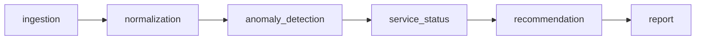

# Architecture — Choix Techniques Détaillés

## Vue d'ensemble

Pipeline en 6 nœuds orchestré par LangGraph, état partagé typé via Pydantic.



## Pourquoi LangGraph ?

Le sujet suggère explicitement LangGraph ou LangChain. LangGraph est le bon choix ici :

- **État explicite et typé** — `PipelineState` est un modèle Pydantic, chaque nœud sait exactement ce qu'il reçoit et ce qu'il produit.
- **Modularité** — chaque nœud est une fonction pure testable indépendamment.
- **Évolution facile** — on peut ajouter une branche conditionnelle (ex : skip le LLM si trop d'erreurs) sans réécrire le pipeline.
- **Visualisation native** — `graph.get_graph().draw_mermaid()` produit le diagramme directement.
- **Standard de fait** pour les systèmes agentiques modernes en production (utilisé chez de nombreuses startups Y Combinator).

## Pourquoi Mistral ?

Critères évalués :

| Critère | Mistral | OpenAI | Claude |
|---|---|---|---|
| Souveraineté EU | ✅ | ❌ | ❌ |
| Conformité RGPD native | ✅ | ⚠️ | ⚠️ |
| Qualité raisonnement structuré | ✅ | ✅ | ✅ |
| Mode JSON natif | ✅ | ✅ | ⚠️ |
| Pertinence pour PME française | ✅✅ | ✅ | ✅ |

Pour un CTO de PME française, Mistral est le bon choix par défaut : performance comparable, alignement réglementaire, hébergement européen possible. La couche `MistralClient` est volontairement isolée pour permettre un swap futur.

## Détection déterministe vs LLM

Décision clé : **on n'utilise pas le LLM pour détecter les anomalies**.

| Tâche | Méthode | Pourquoi |
|---|---|---|
| Détecter un CPU > 85% | Seuil déterministe | Reproductible, zéro coût, instantané, auditable |
| Détecter un point statistiquement aberrant | Z-score | Bien étudié, fiable, explicable |
| Détecter un service offline | Comparaison directe | Trivial |
| **Expliquer** pourquoi le CPU monte à 95% | LLM | Raisonnement contextuel, langage naturel |
| **Recommander** une action concrète | LLM | Créativité, formulation pédagogique |
| **Synthétiser** pour le CTO | LLM | Style, ton, priorisation |

C'est l'inverse de la dérive courante "tout faire avec un LLM" : on l'utilise pour ce qu'il fait mieux que tout le reste (langage), pas pour remplacer des outils statistiques éprouvés.

## Pourquoi Pydantic partout ?

- **Validation stricte aux frontières** — les données invalides sont rejetées dès l'ingestion, pas au milieu du pipeline.
- **Schémas auto-documentés** — `models.py` est la source de vérité.
- **Sérialisation JSON gratuite** — `report.model_dump_json(indent=2)` et c'est fini.
- **Types runtime** — IDE et linter comprennent immédiatement la structure.

## Mode dégradé

Si `MISTRAL_API_KEY` n'est pas définie ou si l'appel échoue :
- Les nœuds déterministes fonctionnent normalement
- `recommendation_node` bascule sur `_fallback_recommendations()` qui produit des recommandations basiques mais utiles
- `report_node` utilise `_fallback_summary()` mécanique
- Le pipeline ne crash jamais, l'utilisateur reçoit toujours quelque chose d'exploitable

C'est important pour une PME : le service ne tombe pas si l'API LLM est down.

## Configuration

Tous les seuils sont dans `config.py` et surchargeable via `.env` :

```env
CPU_THRESHOLD=85.0
LATENCY_THRESHOLD_MS=300.0
ZSCORE_THRESHOLD=2.5
```

L'utilisateur peut adapter les seuils à son contexte sans toucher au code.

## Tests

3 niveaux :

1. **Unitaires** — `test_ingestion.py`, `test_anomaly_detection.py`
2. **Intégration** — `test_pipeline.py` qui exécute le graphe complet sur les vraies données (en mode dégradé sans LLM)
3. **End-to-end avec LLM** — non automatisé pour éviter la dépendance à une clé API en CI

## Évolutions possibles

- Ingestion temps réel via Kafka/Redis Streams au lieu de JSON statique
- Nœud de **détection de tendances** (montée continue sur N snapshots)
- Branche conditionnelle : si `len(anomalies) > seuil`, lancer un nœud de triage avant LLM
- Persistance des rapports en base (Postgres) pour comparer les périodes
- Webhook Slack/Teams quand sévérité critical
- Modèle Mistral local (Mistral Small via Ollama) pour zéro coût marginal
